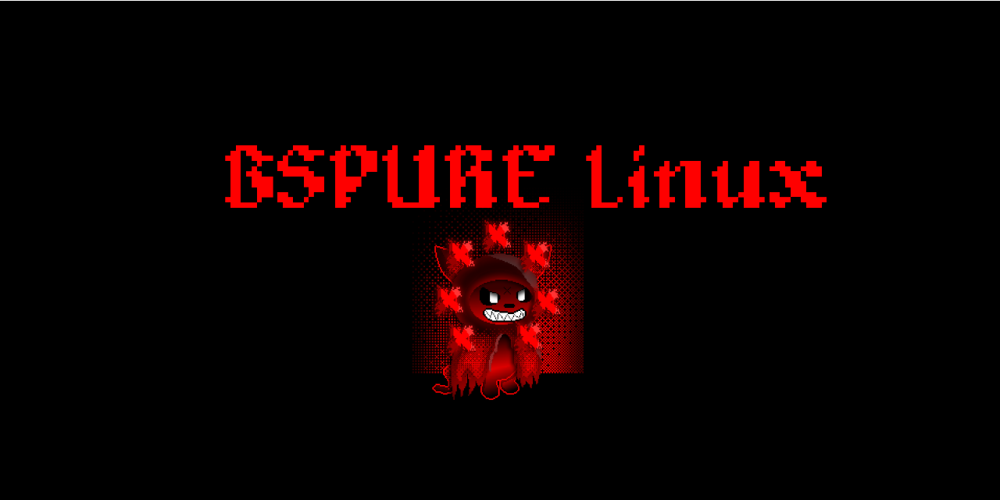

# BSPURE

[](https://github.com/rediskazavr/BSPURE)
[](https://github.com/rediskazavr/BSPURE)
[](https://github.com/rediskazavr/BSPURE/issues)
[](https://github.com/rediskazavr/BSPURE/blob/master/LICENSE)

<p align="center">
  
</p>

BSPURE - BSPWM dotfiles for Arch Linux, this build is lightweight and simple. You can download both the scripted version and the .iso image.

> [!IMPORTANT]
> Attention! This repository is under development, and some features may not work. Install and test strictly on a virtual machine!

## How to install:
```
git clone https://github.com/rediskazavr/BSPURE
cd BSPURE
chmod +x install.sh
./install.sh
```
## Support Me
<p align="center">
  
</p>

> [!IMPORTANT]
> Bitcoin: bc1qgdasrl0m8n3gxqn3wl03xd7v95s52u7ufu65ms (TrustWallet: Send only Bitcoin (BTC) to this address. Sending any other coins may result in loss of funds).
